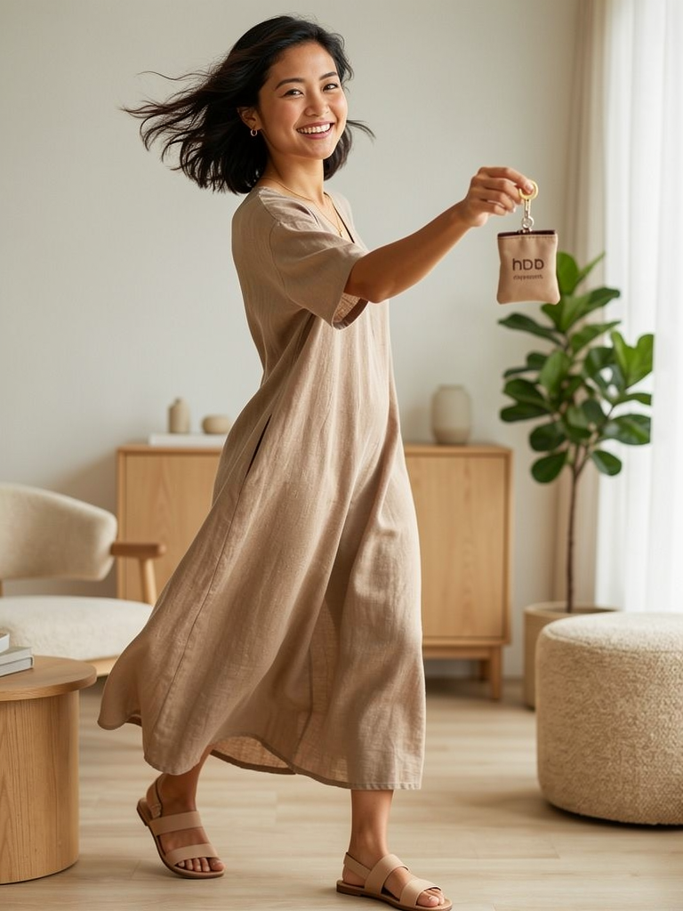
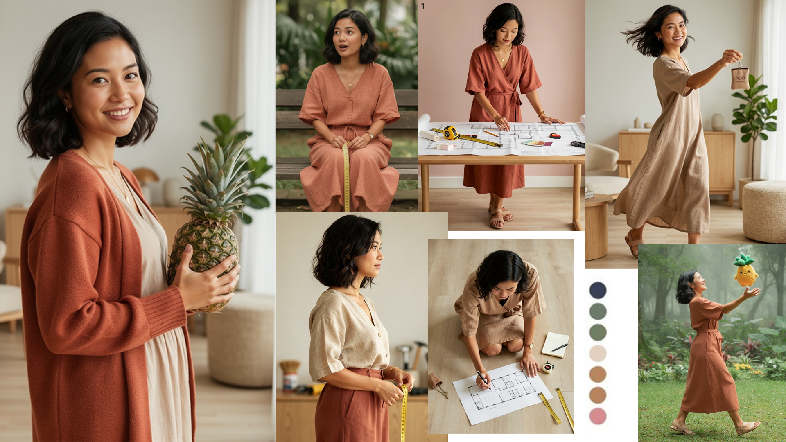
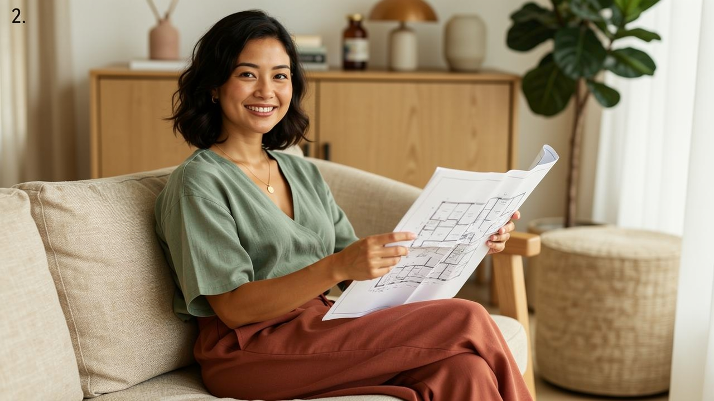
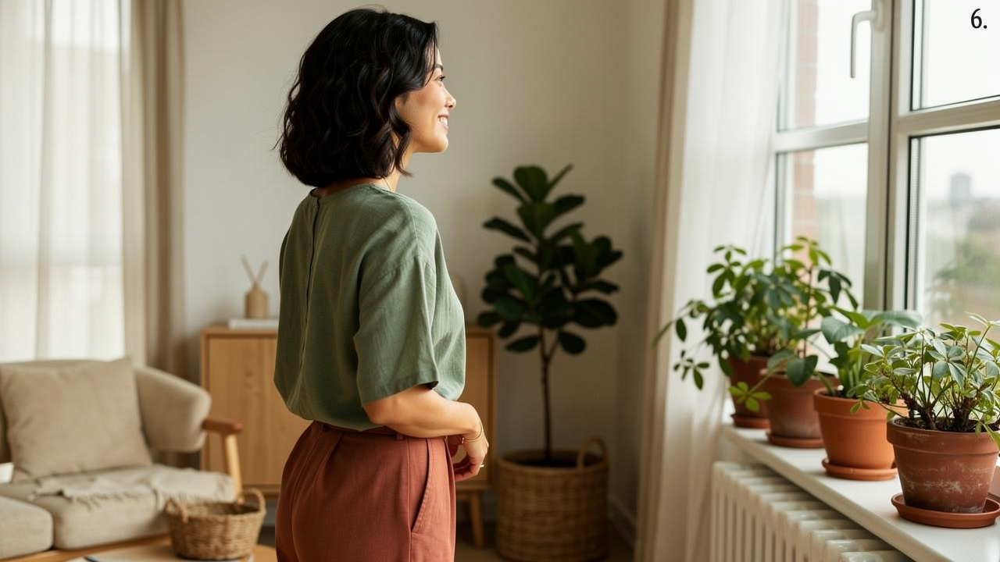

1. i generate a few variation of how the character should be, based on the prompt i provided.
the examples are: 

2. in the end, i picked the forth option, and start generating from there

3. then i started to generate variations of her in different scenario and outfit, based on the prompt i provided

4. I then made a moodboard to compile all the inspiration pictures

5. I then started to generate the scripts of the shorts, with an example topic of a ABSD
[Script here](./absd_shorts_script.md)

6. I then started to generate keyframes for the short, according to the script

7. I then started to generate the short video using the keyframes
<video src="Frames/v1.mp4" width="600" controls>
  Video
</video>
<video src="Frames/v2.mp4" width="600" controls>
  Video
</video>
<video src="Frames/v3.mp4" width="600" controls>
  Video
</video>
<video src="Frames/v4.mp4" width="600" controls>
  Video
</video>
<video src="Frames/v5a.mp4" width="600" controls>
  Video
</video>

8. Finally, i compile it all into one final video
<video src="./Virtual Influencer v1.mp4" width="600" controls>
  Video
</video>

9. Potential Use cases
we can use this to generate short videos for social media, with different characters and scenarios
we can also use this to generate long videos for youtube, with different characters and scenarios
the cost will be significantly lower than having a crew to do it themselves