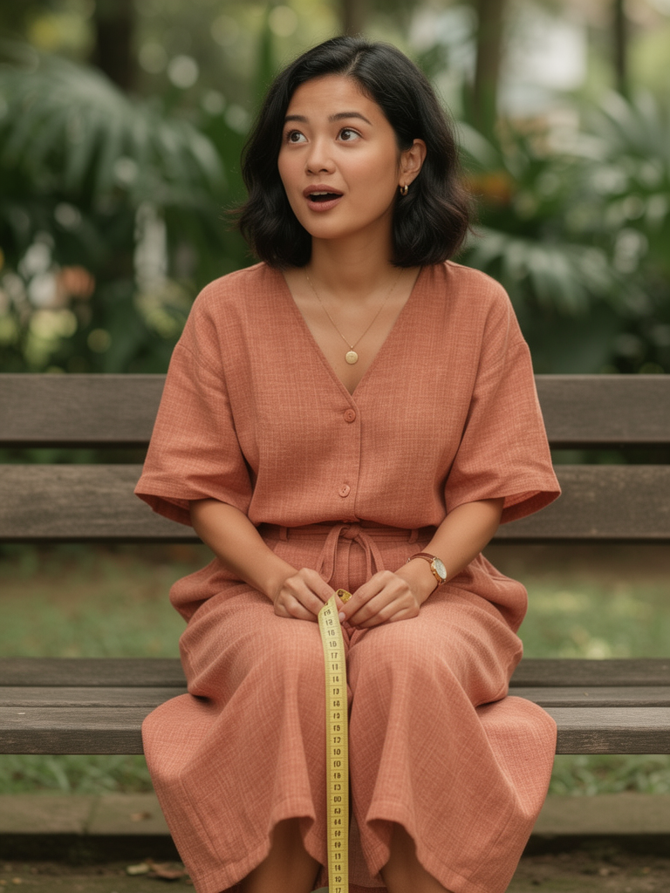

# Project Virtual Influencer

## This is a case study on how I created the character profile for Project Virtual Influencer

### Goal: Create a virtual influencer persona that we can use as a presenter in video, without worrying copyrights, people availability, etc. Anytime, anywhere, anything we want.

### Step 1: Market Research
I first started researching how I want the person to look like, and what is the background motivation of the persona. This is important to give the persona a character. [Full research here](./Documents/Mascot%20Design,%20and%20Market%20Research.pdf)

### Step 2: Deciding the looks

1. I generate a few variation of how the character should be, based on the prompt i provided. The examples are: 

2. In the end, I picked the forth option, and start generating from there

3. Then i started to generate variations of her in different scenario and outfit, based on the prompt I provided

4. I then made a moodboard to compile all the inspiration pictures

5. I then started to generate the scripts of the shorts, with an example topic of a ABSD
[Script here](./absd_shorts_script.md)

6. Next step is to generate keyframes for the shorts, according to the script

7. I then started to generate the short video using the keyframes. The models used are Gemini 3.1 Flash Preview, Nano Banana 2, Kling 3.0
<video src="Frames/v1.mp4" width="600" controls>
  Video
</video>
<video src="Frames/v2.mp4" width="600" controls>
  Video
</video>
<video src="Frames/v3.mp4" width="600" controls>
  Video
</video>
<video src="Frames/v4.mp4" width="600" controls>
  Video
</video>
<video src="Frames/v5a.mp4" width="600" controls>
  Video
</video>

8. Finally, I compile it all into one final video
[Link to the video](./Virtual%20Influencer%20v1.mp4)

9. Potential Use cases
we can use this to generate shorts for social media or long form videos for YouTube, with different characters and scenarios. The cost will be significantly lower than having a crew to do it themselves.

10. Note: This project is a proof of concept, with more data and development, I can see this project to be more and more capable and potential.
